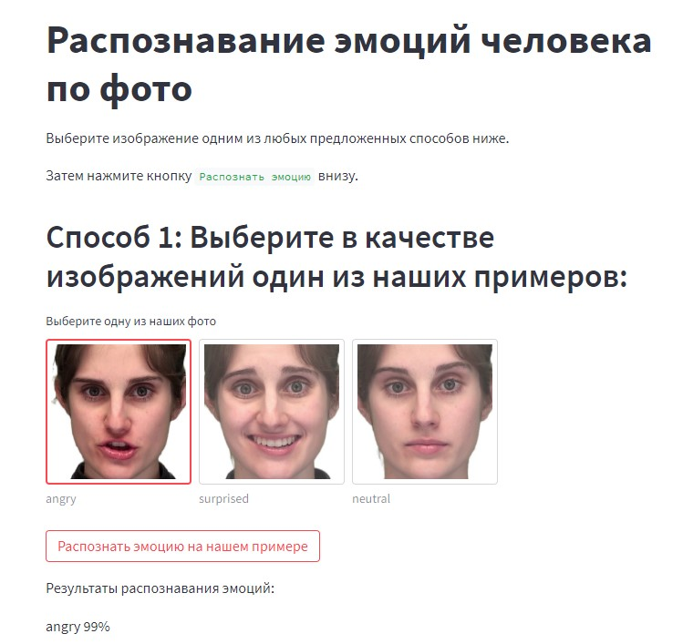
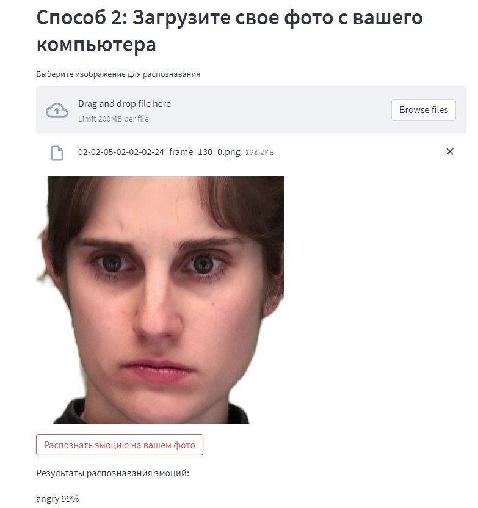

# Описание

Репозиторий содержит код для развертывания приложения для классификации эмоций человека по фото в облаке `Streamlit Cloud`.

Ссылка на запущенное веб-приложение([ссылка](https://medphisiker-emotion-streamlit-app-streamlit-start-n8kbdm.streamlit.app/)).
